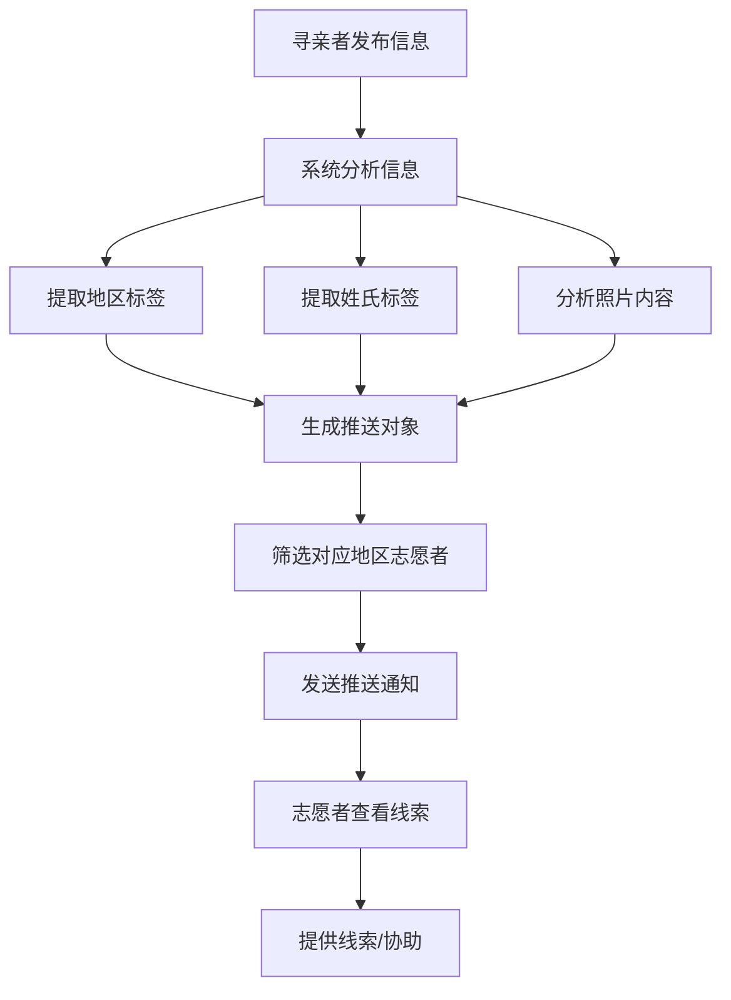

# 寻亲路 - 潮汕泰国寻亲平台

## 1. 产品概述

一款连接潮汕人与泰国华侨的寻亲平台应用，灵感源自"给阿嬷的情书"的动人故事。帮助因历史原因离散的家族重新建立联系，让血脉亲情跨越国界延续。

- 解决潮汕地区与泰国华侨之间因历史移民潮导致的亲人失联问题
- 为寻亲者提供信息发布、匹配、沟通的一站式服务平台
- 支持多端访问：Web应用、微信小程序、多语言国际化
- **新增**：志愿者协作系统，智能推送机制，图片/文字识别功能

## 2. 核心功能

### 2.1 用户角色

| 角色 | 注册方式 | 核心权限 | 功能特性 |
|------|----------|----------|----------|
| **寻亲者** | 手机号/微信注册 | 发布寻亲信息、浏览、沟通 | 上传老照片、填写家族故事、位置标记、智能推送匹配 |
| **志愿者** | 申请认证 | 协助核实信息、翻译、提供线索 | 地区选择、多语言支持、线索推送、认证徽章 |
| **管理员** | 后台登录 | 审核内容、管理用户、数据统计 | 内容审核、用户管理、数据看板 |

### 2.2 功能模块

1. **首页**: 寻亲故事轮播、快速搜索、最新寻亲动态、成功案例展示
2. **角色选择页**: 用户注册后选择身份（寻亲者/志愿者）
3. **寻亲发布页**: 信息填写表单、照片上传（智能识别）、家族历史记录
4. **寻亲列表页**: 筛选搜索、卡片列表、地图定位展示
5. **寻亲详情页**: 详细信息、照片墙、联系方式、线索提供入口
6. **志愿者工作台**: 待处理线索、推送管理、我的协助案例
7. **个人中心**: 我的发布、收藏、消息通知、身份认证、角色管理
8. **语言切换**: 支持中文简体、中文繁体、泰文、法文、英文
9. **消息推送**: 智能地区匹配推送、线索通知、成功案例推送

### 2.3 页面详情

| 页面名称 | 模块名称 | 功能描述 |
|----------|----------|----------|
| 角色选择 | 身份选择 | 选择"我是寻亲者"或"我是志愿者"，引导式流程 |
| 寻亲发布 | 基本信息表单 | 姓名、性别、出生年份、籍贯等 |
| 寻亲发布 | 家族信息 | 祖辈姓名、迁移年代、海外落脚地等 |
| 寻亲发布 | 照片上传（智能识别） | 老照片上传、照片描述、自动位置识别、OCR提取文字 |
| 寻亲发布 | 地图标记 | 在地图上标记可能的地区 |
| 寻亲列表 | 筛选面板 | 地区、姓氏、年代、状态筛选 |
| 寻亲列表 | 列表展示 | 卡片式寻亲信息展示 |
| 寻亲详情 | 信息展示 | 完整寻亲信息、照片墙 |
| 寻亲详情 | 互动功能 | 提供线索、收藏、分享、联系 |
| 志愿者工作台 | 推送通知 | 智能推送匹配地区的寻亲信息 |
| 志愿者工作台 | 线索管理 | 查看、处理、提供线索 |
| 志愿者工作台 | 我的协助 | 已协助的寻亲案例 |
| 个人中心 | 用户信息 | 头像、昵称、认证状态 |
| 个人中心 | 我的发布 | 已发布寻亲信息管理 |
| 个人中心 | 消息中心 | 系统通知、线索回复、推送通知 |

## 3. 核心流程

### 3.1 角色选择与注册流程

用户访问 → 选择语言 → 选择角色（寻亲者/志愿者）→ 填写基本信息 → 认证（志愿者）→ 进入平台

### 3.2 寻亲发布流程（含智能识别）

1. 选择身份（寻亲者）→ 填写基本信息 → 上传老照片（系统自动分析）
   - 自动OCR提取照片中的文字
   - 识别照片中的地标、建筑风格
   - 分析照片年代特征
2. 填写家族故事 → 标记可能的地区 → 预览信息 → 提交发布
3. 系统自动推送给对应地区的志愿者 → 等待线索

### 3.3 志愿者匹配流程

1. 选择身份（志愿者）→ 选择擅长地区/语言 → 申请认证
2. 审核通过 → 系统推送匹配的寻亲信息
3. 查看推送 → 提供线索 → 跟进进度 → 成功协助

### 3.4 推送匹配机制

## 4. 用户界面设计

### 4.1 设计风格

- **主色调**: 暖橙色 (#E67E22) 象征家的温暖与希望，深棕色 (#5D4037) 代表历史的厚重
- **辅助色**: 米白色 (#FFF8E7) 作为背景，金色 (#D4A574) 作为点缀
- **字体**: 使用思源宋体作为标题字体，展现文化底蕴；思源黑体作为正文字体，保证可读性
- **布局**: 卡片式布局，圆角设计，营造温馨亲切感
- **图标**: 线性图标配合填充状态，简洁现代
- **风格定位**: 温暖怀旧、人文关怀、信任可靠

### 4.2 页面设计概览

| 页面名称 | 模块名称 | UI元素 |
|----------|----------|--------|
| 角色选择 | 身份卡片 | 双卡片设计，悬停效果，选择动画 |
| 寻亲发布 | 智能上传 | 拖拽上传区、预览、识别结果展示、进度条 |
| 寻亲发布 | 地图标记 | 地图组件、标记工具、地区确认 |
| 志愿者工作台 | 推送列表 | 卡片式推送、优先级标识、一键响应 |
| 首页 | Hero轮播区 | 全屏渐变背景、大标题动画、统计数据卡片、向下滚动指示器 |
| 首页 | 快速搜索 | 圆角搜索框、姓氏快捷标签、地区下拉选择、搜索按钮 |
| 首页 | 最新动态 | 横向滚动卡片、照片缩略图、姓名高亮、地区标签 |
| 首页 | 成功案例 | 网格布局、故事卡片、前后对比照片、感人语录 |
| 寻亲详情 | 信息展示 | 时间线布局、信息分组、照片画廊、地图定位 |
| 寻亲详情 | 互动功能 | 固定底部操作栏、提供线索按钮、收藏图标、分享菜单 |
| 个人中心 | 功能列表 | 图标列表项、右侧箭头、未读消息角标、角色切换 |

### 4.3 响应式设计

- **Web端**: 桌面优先设计，适配大屏幕浏览体验
- **平板端**: 两栏布局，侧边栏折叠为抽屉
- **移动端**: 单栏布局，底部导航栏，触摸优化
- **微信小程序**: 原生小程序体验，微信生态集成

### 4.4 情感化设计

- 首页背景使用潮汕老照片与泰国华人社区照片的渐变融合效果
- 成功案例页面使用时间线叙事，展现寻亲历程
- 关键操作使用微动画，如发布成功后的纸鹤飞行动画
- 空状态使用温馨插画，鼓励用户行动
- 多语言界面提供本地化内容和服务

## 5. 多语言支持

### 5.1 支持的语言

| 语言 | 目标用户群 | 地区 |
|------|-----------|------|
| 中文简体 | 潮汕地区用户 | 中国大陆 |
| 中文繁体 | 台湾、香港、澳门 | 大中华区 |
| 泰文 | 泰国华侨 | 泰国 |
| 马来文 | 马来西亚华侨 | 马来西亚 |
| 印尼文 | 印尼华侨 | 印度尼西亚 |
| 新加坡华文 | 新加坡华侨 | 新加坡 |
| 法文 | 法国华人 | 法国 |
| 英文 | 通用国际用户 | 全球 |

### 5.2 语言切换功能

- 全局语言切换入口（支持动态切换）
- 保存用户语言偏好
- 支持RTL语言支持（预留）

### 5.3 地区拓展规划

1. **第一阶段**：泰国、新加坡
2. **第二阶段**：马来西亚、印尼
3. **第三阶段**：法国、欧洲其他国家
4. **第四阶段**：全球其他地区

## 6. 小程序规划

### 6.1 微信小程序功能

- 微信生态深度集成（微信登录、分享到好友、分享到朋友圈、分享给朋友看等）
- 轻量化体验优化
- 微信支付支持（募捐功能、捐赠）
- 消息通知（服务号推送）
- 位置服务（地图、附近的人）
- 扫一扫功能（快速查看寻亲信息二维码）
- 语音转文字（方便老年用户）
- 图片识别（旧照片修复辅助）

### 6.2 其他平台

1. **微信小程序**：主要移动端入口
2. **Web应用**：主要桌面端入口
3. **H5应用**：移动端浏览器访问

### 6.3 功能对比

| 功能 | Web应用 | 微信小程序 |
|------|---------|------------|
| 发布寻亲信息 | ✓ | ✓ |
| 浏览寻亲列表 | ✓ | ✓ |
| 搜索筛选 | ✓ | ✓ |
| 详细信息查看 | ✓ | ✓ |
| 提供线索 | ✓ | ✓ |
| 消息通知 | ✓ | ✓ |
| 微信生态 | ✓ | ✓ |
| 地图定位 | ✓ | ✓ |
| 微信分享 | - | ✓ |
| 微信支付 | - | ✓ |
| 语音转文字 | - | ✓ |
| 智能照片识别 | ✓ | ✓ |
| 志愿者推送 | ✓ | ✓ |

## 7. 智能推送系统

### 7.1 推送规则

1. **地区匹配**：根据寻亲信息中的目标地区，推送给该地区的志愿者
2. **姓氏匹配**：优先推送给相同姓氏的志愿者或有成功案例的志愿者
3. **语言匹配**：根据寻亲者使用的语言，匹配掌握该语言的志愿者
4. **热度优先**：发布时间越新的信息优先级越高
5. **活跃度优先**：推送给近期活跃的志愿者

### 7.2 推送方式

- 网站内消息通知
- 邮件通知（可选）
- 小程序订阅消息
- 浏览器推送通知

### 7.3 志愿者设置

- 可选择接收推送的地区
- 可设置接收推送的时间段
- 可选择接收推送的频率
- 可随时暂停推送
