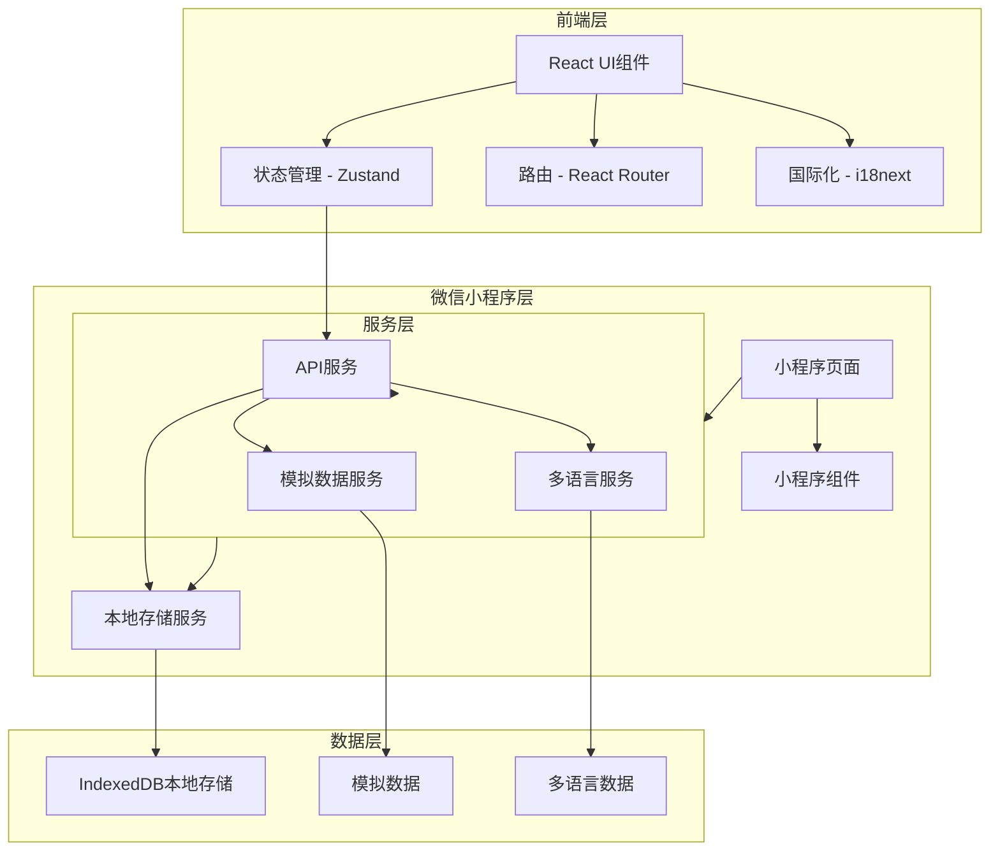
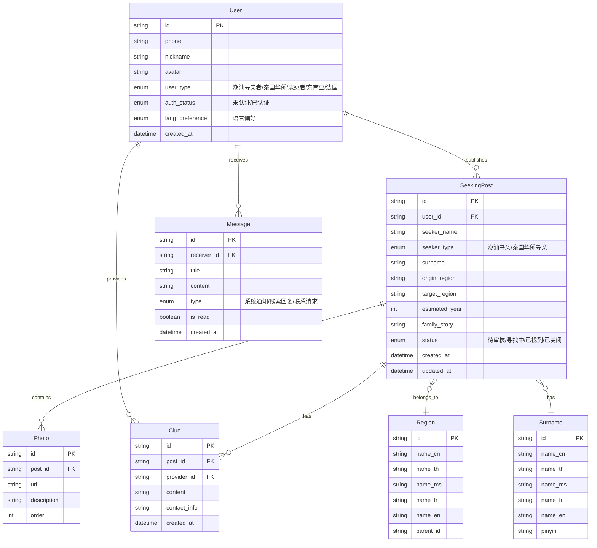

# 寻亲路 - 技术架构文档

## 1. 架构设计



## 2. 技术说明

### 2.1 Web端技术栈

- **前端框架**: React 18 + TypeScript
- **样式方案**: Tailwind CSS 3 + CSS Variables
- **构建工具**: Vite
- **状态管理**: Zustand (轻量级状态管理)
- **路由**: React Router v6
- **动画**: Framer Motion
- **数据持久化**: IndexedDB (Dexie.js)
- **国际化**: i18next (支持中文/泰文/法文/马来文/英文)
- **地图服务**: Leaflet (开源地图)

### 2.2 微信小程序技术栈

- **小程序框架**: 原生微信小程序 / Uni-App (跨平台)
- **样式方案**: WXSS + Tailwind CSS (转换)
- **状态管理**: 小程序原生 + 轻量级Store
- **地图服务**: 腾讯地图 / 微信地图接口
- **微信生态**: 微信登录、支付、分享、订阅消息、位置、扫一扫
- **语音识别**: 微信同声传译

### 2.3 多语言技术方案

- **框架**: i18next + react-i18next
- **支持语言**: zh-CN, zh-TW, th-TH, ms-MY, id-ID, fr-FR, en-US
- **语言检测**: 浏览器语言 + 用户偏好
- **动态加载**: 按需加载语言文件

## 3. 路由定义

### 3.1 Web端路由

| 路由 | 页面 | 描述 |
|------|------|------|
| `/` | 首页 | 平台入口，展示寻亲故事和快速搜索 |
| `/search` | 寻亲列表页 | 搜索和筛选寻亲信息 |
| `/search/:id` | 寻亲详情页 | 查看寻亲详细信息 |
| `/publish` | 发布寻亲页 | 发布新的寻亲信息 |
| `/profile` | 个人中心 | 用户信息和管理 |
| `/profile/my-posts` | 我的发布 | 管理已发布信息 |
| `/profile/messages` | 消息中心 | 查看通知和消息 |
| `/success-stories` | 成功案例 | 寻亲成功故事展示 |

### 3.2 微信小程序页面

| 页面路径 | 页面名称 | 描述 |
|---------|---------|------|
| `pages/index/index` | 首页 | 小程序入口 |
| `pages/search/search` | 搜索页 | 寻亲搜索和筛选 |
| `pages/detail/detail` | 详情页 | 寻亲信息详情 |
| `pages/publish/publish` | 发布页 | 发布寻亲信息 |
| `pages/profile/profile` | 个人中心 | 用户信息 |
| `pages/success-stories/success-stories` | 成功案例 | 成功案例展示 |

## 4. 数据模型

### 4.1 数据模型定义



### 4.2 数据定义语言

```typescript
interface User {
  id: string;
  phone: string;
  nickname: string;
  avatar?: string;
  userType: 'chaoshan_seeker' | 'thai_chinese_seeker' | 'southeast_asian_seeker' | 'french_chinese_seeker' | 'volunteer';
  authStatus: 'unverified' | 'verified';
  langPreference: 'zh-CN' | 'zh-TW' | 'th-TH' | 'ms-MY' | 'id-ID' | 'fr-FR' | 'en-US';
  createdAt: Date;
}

interface SeekingPost {
  id: string;
  userId: string;
  seekerName: string;
  seekerType: 'chaoshan_to_thai' | 'thai_to_chaoshan' | 'chaoshan_to_southeast' | 'southeast_to_chaoshan' | 'chaoshan_to_france' | 'france_to_chaoshan';
  surname: string;
  originRegion: string;
  targetRegion: string;
  estimatedYear: number;
  familyStory: string;
  status: 'pending' | 'searching' | 'found' | 'closed';
  photos: Photo[];
  createdAt: Date;
  updatedAt: Date;
}

interface Photo {
  id: string;
  postId: string;
  url: string;
  description?: string;
  order: number;
}

interface Clue {
  id: string;
  postId: string;
  providerId: string;
  content: string;
  contactInfo?: string;
  createdAt: Date;
}

interface Message {
  id: string;
  receiverId: string;
  title: string;
  content: string;
  type: 'system' | 'clue_reply' | 'contact_request';
  isRead: boolean;
  createdAt: Date;
}

interface Region {
  id: string;
  nameCn: string;
  nameTh: string;
  nameMs: string;
  nameFr: string;
  nameEn: string;
  parentId?: string;
}

interface Surname {
  id: string;
  nameCn: string;
  nameTh: string;
  nameMs: string;
  nameFr: string;
  nameEn: string;
  pinyin: string;
}
```

## 5. 组件架构

### 5.1 Web端组件树

```
App
├── Layout
│   ├── Header
│   │   ├── Logo
│   │   ├── Navigation
│   │   ├── LanguageSwitcher
│   │   └── UserMenu
│   ├── Main
│   │   └── [Page Components]
│   └── Footer
├── Pages
│   ├── HomePage
│   │   ├── HeroSection
│   │   ├── QuickSearch
│   │   ├── LatestPosts
│   │   └── SuccessStories
│   ├── SearchPage
│   │   ├── FilterPanel
│   │   ├── PostList
│   │   └── PostCard
│   ├── PostDetailPage
│   │   ├── PostHeader
│   │   ├── PhotoGallery
│   │   ├── InfoTimeline
│   │   └── ActionPanel
│   ├── PublishPage
│   │   ├── StepIndicator
│   │   ├── BasicInfoForm
│   │   ├── FamilyInfoForm
│   │   └── PhotoUpload
│   ├── ProfilePage
│   │   ├── UserCard
│   │   ├── StatsCard
│   │   └── MenuList
│   └── SuccessStoriesPage
└── Common
    ├── Button
    ├── Input
    ├── Card
    ├── Modal
    ├── Loading
    ├── EmptyState
    └── LanguageSwitcher
```

### 5.2 微信小程序组件

```
pages
├── index
│   ├── index.wxml
│   ├── index.wxss
│   └── index.js
├── search
├── detail
├── publish
├── profile
└── success-stories

components
├── post-card
├── photo-gallery
├── language-switcher
├── step-indicator
└── custom-tabbar
```

### 5.3 状态管理

```typescript
interface AppState {
  user: User | null;
  posts: SeekingPost[];
  currentPost: SeekingPost | null;
  filters: SearchFilters;
  messages: Message[];
  currentLang: string;
  
  setUser: (user: User | null) => void;
  setPosts: (posts: SeekingPost[]) => void;
  setCurrentPost: (post: SeekingPost | null) => void;
  setFilters: (filters: SearchFilters) => void;
  addMessage: (message: Message) => void;
  markMessageRead: (messageId: string) => void;
  setLanguage: (lang: string) => void;
}

interface SearchFilters {
  surname?: string;
  originRegion?: string;
  targetRegion?: string;
  yearRange?: [number, number];
  status?: SeekingPost['status'];
  seekerType?: SeekingPost['seekerType'];
}
```

## 6. 多语言架构

### 6.1 语言文件结构

```
src/locales/
├── index.ts
├── zh-CN/
│   ├── common.json
│   ├── home.json
│   ├── search.json
│   ├── publish.json
│   ├── profile.json
│   └── success.json
├── zh-TW/
│   └── [同zh-CN结构]
├── th-TH/
│   └── [同zh-CN结构]
├── ms-MY/
│   └── [同zh-CN结构]
├── fr-FR/
│   └── [同zh-CN结构]
└── en-US/
    └── [同zh-CN结构]
```

### 6.2 i18next配置

```typescript
import i18n from 'i18next';
import { initReactI18next } from 'react-i18next';

const resources = {
  'zh-CN': {
    translation: require('./locales/zh-CN/common.json')
  },
  'th-TH': {
    translation: require('./locales/th-TH/common.json')
  },
  // ...其他语言
};

i18n.use(initReactI18next).init({
  resources,
  lng: 'zh-CN',
  fallbackLng: 'en-US',
  interpolation: {
    escapeValue: false
  }
});
```

## 7. 微信小程序架构

### 7.1 Uni-App跨平台方案

使用Uni-App框架实现小程序开发，支持：
- 微信小程序
- 支付宝小程序
- H5应用
- App打包

### 7.2 微信生态集成

- **微信登录**: 实现微信一键登录，获取用户信息
- **微信分享**: 分享到好友、朋友圈，带有自定义分享文案和图片
- **微信支付**: 集成微信支付，支持募捐/打赏功能
- **订阅消息**: 消息推送，如新线索通知、寻亲成功通知
- **位置服务**: 获取用户位置，提供附近的人功能
- **扫一扫**: 扫描寻亲信息二维码
- **图片上传**: 支持图片压缩和上传
- **语音转文字**: 方便老年用户输入

### 7.3 小程序性能优化

- 分包加载
- 图片懒加载
- 列表虚拟滚动
- 缓存策略优化
- 预加载策略

## 8. 模拟数据

项目将使用模拟数据来演示功能，包含：

- 20+ 条寻亲信息示例（潮汕寻亲和泰国华侨寻亲各半）
- 10+ 个成功案例故事
- 常见姓氏和地区数据
- 用户消息通知示例
- 多语言翻译资源

模拟数据存储在前端，通过服务层模拟API调用，支持：
- 分页加载
- 条件筛选
- 搜索匹配
- 数据持久化（IndexedDB）

## 9. 国际化数据结构

### 9.1 地区数据

```typescript
const regions = [
  {
    id: '1',
    nameCn: '潮州',
    nameTh: 'เฉาโจว',
    nameMs: 'Chaozhou',
    nameFr: 'Chaozhou',
    nameEn: 'Chaozhou'
  },
  // ...其他地区
];
```

### 9.2 姓氏数据

```typescript
const surnames = [
  {
    id: '1',
    nameCn: '陈',
    nameTh: 'ตัน',
    nameMs: 'Tan',
    nameFr: 'Chen',
    nameEn: 'Chen',
    pinyin: 'chen'
  },
  // ...其他姓氏
];
```
